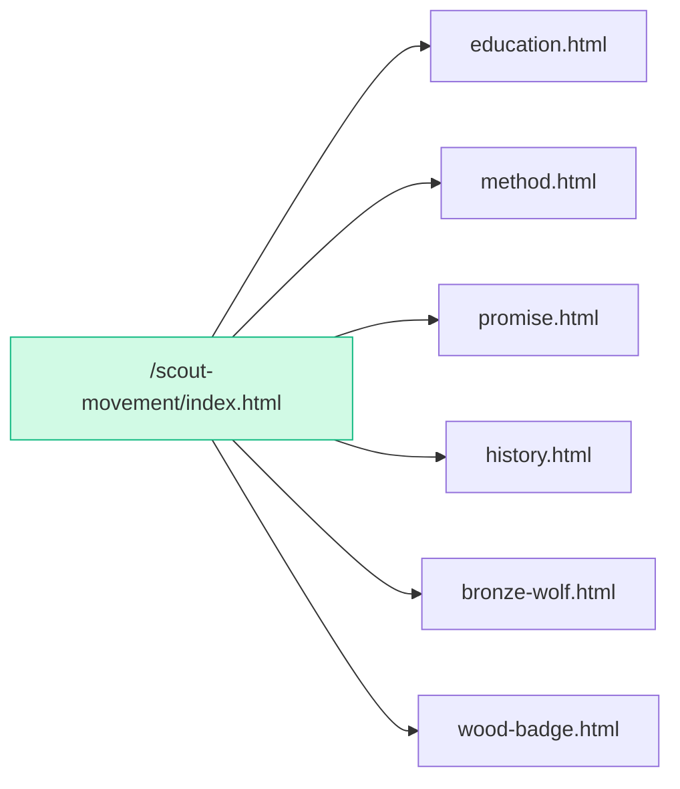
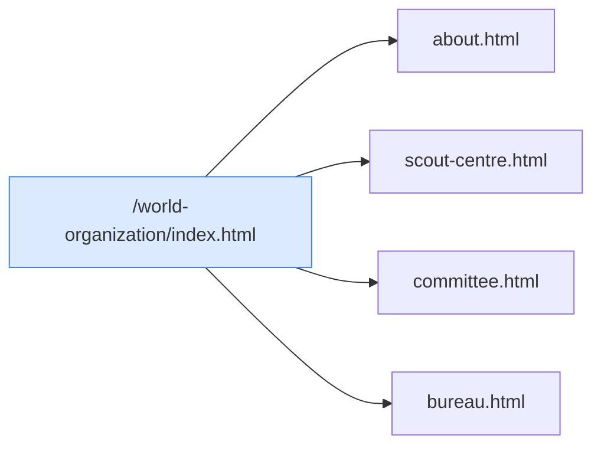
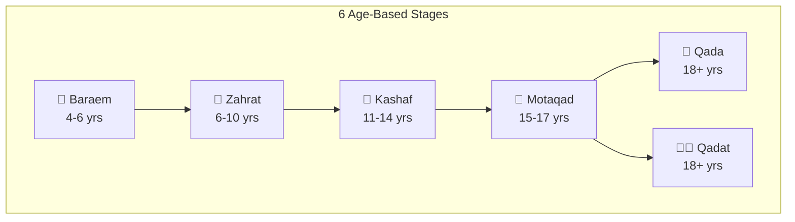
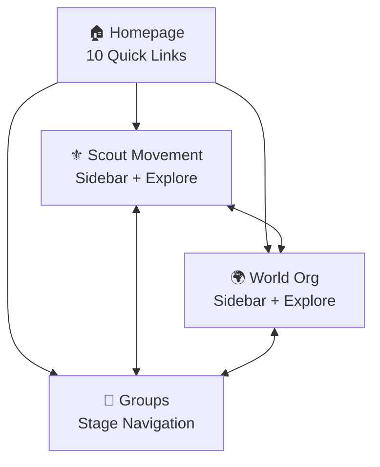

# Al-Salam Scout Groups Website - Implementation Plan

> Complete technical specification and implementation roadmap for the Scout website.

---

## Overview

The Al-Salam Scout Groups website is a comprehensive bilingual (Arabic/English) platform showcasing scouting activities, group stages, and organizational structure following WOSM standards.

---

## Completed Implementation

### Phase 1: Core Structure ✅

| Component | Status | Description |
|-----------|--------|-------------|
| Homepage | ✅ | Hero, values, gallery, store, contact sections |
| Structure Manager | ✅ | Dynamic header/footer injection via `structure_manager.js` |
| Internationalization | ✅ | AR/EN support via `i18n.js` |
| Navigation | ✅ | Responsive nav with dropdowns, mobile menu |

---

### Phase 2: Scout Movement Section ✅



**7 Pages Created:**
- [index.html](file:///c:/Users/User/Downloads/ai%20pip/scout%20full%20website/scout-movement/index.html) - Landing page with sidebar
- [education.html](file:///c:/Users/User/Downloads/ai%20pip/scout%20full%20website/scout-movement/education.html) - Scout curriculum
- [method.html](file:///c:/Users/User/Downloads/ai%20pip/scout%20full%20website/scout-movement/method.html) - Scout method principles
- [promise.html](file:///c:/Users/User/Downloads/ai%20pip/scout%20full%20website/scout-movement/promise.html) - Promise & Law
- [history.html](file:///c:/Users/User/Downloads/ai%20pip/scout%20full%20website/scout-movement/history.html) - Scouting history
- [bronze-wolf.html](file:///c:/Users/User/Downloads/ai%20pip/scout%20full%20website/scout-movement/bronze-wolf.html) - Bronze Wolf Award
- [wood-badge.html](file:///c:/Users/User/Downloads/ai%20pip/scout%20full%20website/scout-movement/wood-badge.html) - Wood Badge training

---

### Phase 3: World Organization Section ✅



**5 Pages Created:**
- [index.html](file:///c:/Users/User/Downloads/ai%20pip/scout%20full%20website/world-organization/index.html) - WOSM overview
- [about.html](file:///c:/Users/User/Downloads/ai%20pip/scout%20full%20website/world-organization/about.html) - Organization details
- [scout-centre.html](file:///c:/Users/User/Downloads/ai%20pip/scout%20full%20website/world-organization/scout-centre.html) - Kandersteg (KISC)
- [committee.html](file:///c:/Users/User/Downloads/ai%20pip/scout%20full%20website/world-organization/committee.html) - World Committee
- [bureau.html](file:///c:/Users/User/Downloads/ai%20pip/scout%20full%20website/world-organization/bureau.html) - World Bureau

---

### Phase 4: Scout Group Stages ✅



**6 Rich Content Pages:**

| Stage | Color | Motto | File |
|-------|-------|-------|------|
| البراعم (Baraem) | Yellow | "أنا أحب الجميع" | [baraem.html](file:///c:/Users/User/Downloads/ai%20pip/scout%20full%20website/groups/baraem.html) |
| الزهرات (Zahrat) | Pink | "أسعى لأكون أفضل" | [zahrat.html](file:///c:/Users/User/Downloads/ai%20pip/scout%20full%20website/groups/zahrat.html) |
| الكشاف (Kashaf) | Green | "كن مستعداً" | [kashaf.html](file:///c:/Users/User/Downloads/ai%20pip/scout%20full%20website/groups/kashaf.html) |
| المتقدم (Motaqad) | Blue | "أخدم" | [motaqad.html](file:///c:/Users/User/Downloads/ai%20pip/scout%20full%20website/groups/motaqad.html) |
| القادة (Qada) | Stone | Leadership | [qada.html](file:///c:/Users/User/Downloads/ai%20pip/scout%20full%20website/groups/qada.html) |
| القائدات (Qadat) | Rose | Women Leaders | [qadat.html](file:///c:/Users/User/Downloads/ai%20pip/scout%20full%20website/groups/qadat.html) |

---

### Phase 5: New Sections ✅

**5 Section Index Pages:**
- [/news/index.html](file:///c:/Users/User/Downloads/ai%20pip/scout%20full%20website/news/index.html) - Latest updates
- [/events/index.html](file:///c:/Users/User/Downloads/ai%20pip/scout%20full%20website/events/index.html) - Upcoming events
- [/team/index.html](file:///c:/Users/User/Downloads/ai%20pip/scout%20full%20website/team/index.html) - Leadership team
- [/region/index.html](file:///c:/Users/User/Downloads/ai%20pip/scout%20full%20website/region/index.html) - Regional info
- [/governance/index.html](file:///c:/Users/User/Downloads/ai%20pip/scout%20full%20website/governance/index.html) - Policies

---

### Phase 6: Cross-Linking ✅



**Navigation Improvements:**
- ✅ Homepage Quick Links (10 cards)
- ✅ Scout Movement sidebar (7 links)
- ✅ World Organization sidebar (5 links)
- ✅ "Explore Also" cross-sections
- ✅ Stage Navigation bar (all 6 groups)

---

## Architecture

### File Structure
```
scout full website/
├── index.html
├── login.html, search.html, shop.html, complaints.html
├── js/
│   ├── structure_manager.js  (header/footer injection)
│   └── i18n.js               (translations)
├── scout-movement/           (7 files)
├── world-organization/       (5 files)
├── groups/                   (6 files)
├── news/, events/, team/, region/, governance/  (5 index files)
└── assets (images, fonts, icons via CDN)
```

### Technology Stack
| Technology | Purpose |
|------------|---------|
| Tailwind CSS | Styling, responsive design |
| Lucide Icons | UI iconography |
| Google Fonts (Tajawal) | Arabic typography |
| Vanilla JS Modules | Structure, i18n |

---

## Future Enhancements

### Priority 1: Content Expansion
- [ ] Add individual news articles
- [ ] Add individual event pages
- [ ] Add team member profiles
- [ ] Add photo gallery with lightbox

### Priority 2: Features
- [ ] Search functionality
- [ ] Contact form backend
- [ ] Newsletter signup
- [ ] Activity calendar

### Priority 3: Performance
- [ ] Image optimization
- [ ] Lazy loading
- [ ] Service worker for offline
- [ ] SEO metadata

---

## Running the Website

```bash
cd "c:\Users\User\Downloads\ai pip\scout full website"
python -m http.server 8083
# Open: http://localhost:8083
```

---

## Summary

| Metric | Count |
|--------|-------|
| Total HTML Pages | **28** |
| Scout Movement | 7 |
| World Organization | 5 |
| Group Stages | 6 |
| New Sections | 5 |
| Utility Pages | 5 |
| Cross-Link Types | 4 |
