# 🏕️ Al-Salam Scout Groups - Website Architecture

> Complete visual documentation of the website structure, navigation, and component relationships.

---

## 1. Complete Site Map

```mermaid
flowchart TB
    subgraph HOME["🏠 Homepage"]
        INDEX["/index.html"]
    end

    subgraph AUTH["🔐 Authentication"]
        LOGIN["/login.html"]
        SEARCH["/search.html"]
    end

    subgraph SCOUT["⚜️ Scout Movement"]
        SM_INDEX["/scout-movement/index.html"]
        SM_EDUCATION["/scout-movement/education.html"]
        SM_METHOD["/scout-movement/method.html"]
        SM_PROMISE["/scout-movement/promise.html"]
        SM_HISTORY["/scout-movement/history.html"]
        SM_WOLF["/scout-movement/bronze-wolf.html"]
        SM_WOOD["/scout-movement/wood-badge.html"]
    end

    subgraph WORLD["🌍 World Organization"]
        WO_INDEX["/world-organization/index.html"]
        WO_ABOUT["/world-organization/about.html"]
        WO_CENTRE["/world-organization/scout-centre.html"]
        WO_COMMITTEE["/world-organization/committee.html"]
        WO_BUREAU["/world-organization/bureau.html"]
    end

    subgraph GROUPS["👥 Scout Groups"]
        GR_BARAEM["/groups/baraem.html"]
        GR_ZAHRAT["/groups/zahrat.html"]
        GR_KASHAF["/groups/kashaf.html"]
        GR_MOTAQAD["/groups/motaqad.html"]
        GR_QADA["/groups/qada.html"]
        GR_QADAT["/groups/qadat.html"]
    end

    subgraph SECTIONS["📁 New Sections"]
        NEWS["/news/index.html"]
        EVENTS["/events/index.html"]
        TEAM["/team/index.html"]
        REGION["/region/index.html"]
        GOVERNANCE["/governance/index.html"]
    end

    subgraph UTILITY["🛠️ Utility Pages"]
        SHOP["/shop.html"]
        COMPLAINTS["/complaints.html"]
    end

    INDEX --> SM_INDEX
    INDEX --> WO_INDEX
    INDEX --> GR_BARAEM
    INDEX --> NEWS
    INDEX --> EVENTS
    INDEX --> TEAM
    INDEX --> SHOP
    INDEX --> COMPLAINTS
    INDEX --> LOGIN

    SM_INDEX --> SM_EDUCATION
    SM_INDEX --> SM_METHOD
    SM_INDEX --> SM_PROMISE
    SM_INDEX --> SM_HISTORY
    SM_INDEX --> SM_WOLF
    SM_INDEX --> SM_WOOD

    WO_INDEX --> WO_ABOUT
    WO_INDEX --> WO_CENTRE
    WO_INDEX --> WO_COMMITTEE
    WO_INDEX --> WO_BUREAU

    GR_BARAEM <--> GR_ZAHRAT
    GR_ZAHRAT <--> GR_KASHAF
    GR_KASHAF <--> GR_MOTAQAD
    GR_MOTAQAD <--> GR_QADA
    GR_QADA <--> GR_QADAT
```

---

## 2. Navigation Architecture

```mermaid
flowchart LR
    subgraph HEADER["📌 Main Navigation Header"]
        LOGO["🏕️ Logo"]
        NAV["Navigation Bar"]
        LANG["🌐 Language Toggle"]
        MOBILE["📱 Mobile Menu"]
    end

    subgraph DROPDOWNS["🔽 Dropdown Menus"]
        DD_SCOUT["Scout Movement ▼"]
        DD_GROUPS["Groups ▼"]
        DD_WORLD["World Organization ▼"]
    end

    subgraph DIRECT["➡️ Direct Links"]
        L_NEWS["News"]
        L_EVENTS["Events"]
        L_TEAM["Team"]
        L_REGION["Region"]
    end

    NAV --> DD_SCOUT
    NAV --> DD_GROUPS
    NAV --> DD_WORLD
    NAV --> DIRECT

    DD_SCOUT --> |"7 pages"| SCOUT_PAGES["Education, Method, Promise, History, Bronze Wolf, Wood Badge"]
    DD_GROUPS --> |"6 stages"| GROUP_PAGES["Baraem, Zahrat, Kashaf, Motaqad, Qada, Qadat"]
    DD_WORLD --> |"5 pages"| WORLD_PAGES["About, Scout Centre, Committee, Bureau"]
```

---

## 3. Scout Group Stages Flow

```mermaid
flowchart LR
    subgraph YOUTH["🧒 Youth Stages"]
        B["🌱 البراعم<br/>Baraem<br/>4-6 yrs"]
        Z["🌸 الزهرات<br/>Zahrat<br/>6-10 yrs"]
        K["🧭 الكشاف<br/>Kashaf<br/>11-14 yrs"]
        M["🚀 المتقدم<br/>Motaqad<br/>15-17 yrs"]
    end

    subgraph LEADERS["👨‍🏫 Leadership"]
        Q["👔 القادة<br/>Qada<br/>18+ yrs"]
        QA["👩‍🏫 القائدات<br/>Qadat<br/>18+ yrs"]
    end

    B -->|"أحب الجميع"| Z
    Z -->|"أسعى لأكون أفضل"| K
    K -->|"كن مستعداً"| M
    M -->|"أخدم"| Q
    M -->|"أخدم"| QA

    style B fill:#fef3c7,stroke:#f59e0b,color:#92400e
    style Z fill:#fce7f3,stroke:#ec4899,color:#9d174d
    style K fill:#d1fae5,stroke:#10b981,color:#065f46
    style M fill:#dbeafe,stroke:#3b82f6,color:#1e40af
    style Q fill:#e7e5e4,stroke:#78716c,color:#44403c
    style QA fill:#ffe4e6,stroke:#f43f5e,color:#9f1239
```

---

## 4. Component Architecture

```mermaid
flowchart TB
    subgraph CORE["🧩 Core Components"]
        SM["structure_manager.js"]
        I18N["i18n.js"]
    end

    subgraph INJECTION["💉 Injected Elements"]
        HEADER["Header Component"]
        FOOTER["Footer Component"]
        NAV["Navigation System"]
    end

    subgraph STYLES["🎨 Styling"]
        TW["Tailwind CSS"]
        LUCIDE["Lucide Icons"]
        TAJAWAL["Tajawal Font"]
    end

    subgraph FEATURES["⚡ Features"]
        LANG_TOGGLE["Language Toggle AR/EN"]
        MOBILE_MENU["Mobile Responsive Menu"]
        DROPDOWNS["Dropdown Menus"]
        ANIMATIONS["Hover Animations"]
    end

    SM --> HEADER
    SM --> FOOTER
    SM --> NAV
    I18N --> LANG_TOGGLE

    TW --> HEADER
    TW --> FOOTER
    LUCIDE --> NAV
    TAJAWAL --> HEADER

    NAV --> DROPDOWNS
    NAV --> MOBILE_MENU
    TW --> ANIMATIONS
```

---

## 5. Cross-Linking Strategy

---

## 6. File Structure

```mermaid
flowchart TB
    subgraph ROOT["📁 scout full website/"]
        INDEX_HTML["index.html"]
        LOGIN_HTML["login.html"]
        SEARCH_HTML["search.html"]
        SHOP_HTML["shop.html"]
        COMPLAINTS_HTML["complaints.html"]
    end

    subgraph JS_DIR["📁 js/"]
        STRUCTURE["structure_manager.js"]
        I18N_JS["i18n.js"]
    end

    subgraph SCOUT_DIR["📁 scout-movement/"]
        SM_FILES["index.html<br/>education.html<br/>method.html<br/>promise.html<br/>history.html<br/>bronze-wolf.html<br/>wood-badge.html"]
    end

    subgraph WORLD_DIR["📁 world-organization/"]
        WO_FILES["index.html<br/>about.html<br/>scout-centre.html<br/>committee.html<br/>bureau.html"]
    end

    subgraph GROUPS_DIR["📁 groups/"]
        GR_FILES["baraem.html<br/>zahrat.html<br/>kashaf.html<br/>motaqad.html<br/>qada.html<br/>qadat.html"]
    end

    subgraph SECTIONS_DIR["📁 New Sections"]
        NEWS_DIR["📁 news/index.html"]
        EVENTS_DIR["📁 events/index.html"]
        TEAM_DIR["📁 team/index.html"]
        REGION_DIR["📁 region/index.html"]
        GOV_DIR["📁 governance/index.html"]
    end

    ROOT --> JS_DIR
    ROOT --> SCOUT_DIR
    ROOT --> WORLD_DIR
    ROOT --> GROUPS_DIR
    ROOT --> NEWS_DIR
    ROOT --> EVENTS_DIR
    ROOT --> TEAM_DIR
    ROOT --> REGION_DIR
    ROOT --> GOV_DIR
```

---

## 7. Page Statistics

| Category | Pages | Files |
|----------|-------|-------|
| Main Pages | 5 | index, login, search, shop, complaints |
| Scout Movement | 7 | index, education, method, promise, history, bronze-wolf, wood-badge |
| World Organization | 5 | index, about, scout-centre, committee, bureau |
| Scout Groups | 6 | baraem, zahrat, kashaf, motaqad, qada, qadat |
| New Sections | 5 | news, events, team, region, governance |
| **Total** | **28** | HTML pages |

---

## 8. Technology Stack

